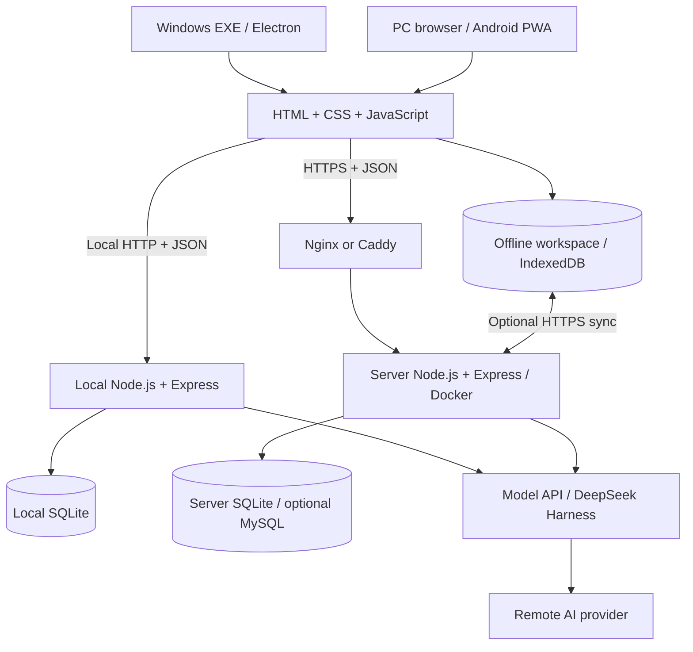

# Dayweave · 时序

**给重要的事留时间。**
**Make room for what matters.**

Dayweave 是面向学生与个人项目的时间管理工具，将课程、作业、项目、日程和灵感放在同一个空间。支持本地离线使用、可选的自托管同步，以及通过 AI 辅助规划和定制工具。

Dayweave is a personal planner for students and independent projects. It brings classes, assignments, projects, schedules, and ideas into one workspace, with local offline editing, optional self-hosted synchronization, and AI-assisted planning and customization.

面向初学者的整体说明：[架构、数据位置、通信与工具链](docs/ARCHITECTURE_GUIDE_ZH.md)。
Beginner-friendly architecture guide (Chinese): [architecture, data storage, communication and toolchain](docs/ARCHITECTURE_GUIDE_ZH.md).

> 当前版本处于早期开发阶段。Windows 提供 Electron 桌面端；Android 通过浏览器或 PWA 使用。本仓库提供源码，尚未选定项目开源许可证。
>
> This project is in early development. Windows uses an Electron desktop app; Android access is through a browser or PWA. Source code is available here, but a project license has not yet been selected.

## 功能 / Features

| 中文 | English |
| --- | --- |
| **课程与日历**：管理学期课表、教学周、单双周和固定日程，支持日、周、月、年视图。 | **Classes and calendar:** manage term schedules, teaching weeks, alternating weeks, and fixed events with day, week, month, and year views. |
| **作业与项目**：记录截止时间、预计耗时、优先级与自定义任务类型；区分“已完成”和“已提交”。 | **Assignments and projects:** track deadlines, estimates, priorities, and custom task types; keep completion and submission separate. |
| **四象限与复盘**：按重要性和紧急程度整理任务，记录每日、每周和每月的进展。 | **Quadrants and reviews:** organize tasks by importance and urgency, and reflect on daily, weekly, and monthly progress. |
| **灵感收件箱**：记录想法、关联项目，支持可调颜色、材质、运动与立体效果的灵感气泡。 | **Idea inbox:** capture ideas, associate them with projects, and display floating bubbles with adjustable colors, materials, motion, and depth. |
| **AI 时间管家**：自然语言整理事项、辅助排程与文件识别；支持不同模型 API 和 Harness 工具调用。 | **AI planning assistant:** turn natural language into actionable items, suggest schedules, and interpret imported files using configurable model APIs and Harness tools. |
| **课表导入**：支持 XLSX、文字 PDF、CSV/TXT；识别后可预览、修改并确认导入。 | **Timetable import:** import XLSX, text-based PDF, and CSV/TXT files, then preview, edit, and confirm the results. |
| **本地与同步**：本地空间可离线编辑，选择自己的服务器，预览同步差异并处理冲突。 | **Local use and sync:** edit a local workspace offline, choose your own server, preview differences, and resolve conflicts. |
| **外观定制**：双主题色、自定义背景、主题预设、字体大小、深浅模式，以及玻璃、亚克力、云母等模拟材质。 | **Appearance:** two theme colors, custom backgrounds, saved presets, font sizing, light/dark modes, and simulated glass, acrylic, mica, and other materials. |
| **Windows 桌面端**：独立窗口、安装程序和系统托盘；关闭窗口后可继续在后台运行。 | **Windows desktop:** a standalone window, installer, and system tray, with background operation after the window is closed. |

## 整体架构 / Architecture

时序是一套网页应用：前端负责显示，Node.js 后端处理账户、数据和 AI。后端既可以运行在自己的电脑，也可以运行在服务器。Windows EXE 包含 Electron 独立窗口和本地运行环境；GitHub 保存源码与发行包，不运行你的日程服务。

Dayweave is a web application with a JavaScript UI and a Node.js backend for accounts, storage, and AI. The backend runs locally or on a server. The Windows installer bundles an Electron window and local runtime; GitHub hosts source and releases, not personal planner data.



| 使用方式 / Mode | 数据位置 / Storage | 联网要求 / Connectivity |
| --- | --- | --- |
| 本机后端 / Local backend | 本机 SQLite；安装版独立空间默认位于 `%LOCALAPPDATA%\Shixu\data` / SQLite on your PC | 日程管理可本机运行；远程 AI 需要网络 / Local planning works without internet; remote AI needs connectivity |
| 云端账户 / Cloud account | 服务器的持久数据卷，各账户独立 / Persistent server volume, scoped by account | 登录和保存需要连接服务器 / Server connection required |
| 浏览器离线空间 / Browser offline workspace | 当前浏览器 IndexedDB / This browser's IndexedDB | 离线资源准备好后可离线编辑；可选择同步 / Offline editing after resources are cached; optional sync |

三种数据空间相互独立，不会因为安装了 EXE 就自动合并。两台设备登录同一云端账户，访问同一份数据；离线空间通过差异预览与冲突处理同步课程、任务、灵感、日程、复盘和业务偏好。密码、AI 密钥和聊天记录不在日程同步范围。主题等设备外观主要使用 localStorage。

These stores are separate. Devices signed into the same cloud account share server data. Offline workspaces synchronize planning records through previews and conflict resolution; passwords, API keys, and chat history are excluded. Device appearance preferences mainly use localStorage.

公网使用 HTTPS（加密的 HTTP）传送 JSON 数据。Nginx/Caddy 是公网入口，转发到内部的应用端口。Docker 镜像是装好程序的模板，容器是运行中的程序，数据卷单独保存账户与日程。Harness 是调用远程模型和工具的引擎，不是本地 DeepSeek 模型；普通 AI 配置与 Harness 安装是两个步骤。

Public traffic uses HTTPS and JSON. Nginx/Caddy forwards requests to the internal app port. A Docker image packages the program, a container runs it, and a volume persists user data. Harness orchestrates remote models and tools; it does not bundle model weights. Installing Harness and configuring your API are separate steps.

GitHub、阿里云和 EXE 分别对应**代码与发行包、在线运行实例、电脑上的安装版本**。推送代码不会自动升级后两者；云端需更新容器，电脑需安装新版本。完整的存储、协议、安全与定制开发说明见 [架构指南](docs/ARCHITECTURE_GUIDE_ZH.md)。

GitHub, your cloud server, and your EXE represent **source/releases, a running deployment, and an installed desktop version**. Pushing source does not upgrade either installation. See the [detailed architecture guide](docs/ARCHITECTURE_GUIDE_ZH.md).

## 本地启动 / Run locally

安装 **Node.js 24 或更高版本** 与 Git，然后执行：
Install **Node.js 24 or later** and Git, then run:

已有 Node.js 22.2 与 MySQL 5.7 的 Windows 服务器可选择 MySQL 后端，使用独立数据库；详见 [Windows + MySQL 部署](docs/WINDOWS_MYSQL.md)。Server 2012 仍需目标机器验收。以下默认启动步骤使用 SQLite。

For Windows servers with Node.js 22.2 and MySQL 5.7, an optional MySQL backend uses a dedicated database. See [Windows + MySQL deployment](docs/WINDOWS_MYSQL.md). Server 2012 still requires target-machine validation. The default steps below use SQLite.

```bash
git clone https://github.com/Xylonzzz/Dayweave.git
cd Dayweave
npm ci
npm start
```

打开 <http://localhost:3088>。Windows 也可以使用项目中的 `start.cmd`。
Open <http://localhost:3088>. On Windows, you can also use `start.cmd`.

首次启动会在 `data/bootstrap.txt` 生成初始登录信息。也可在首次启动前复制 `.env.example` 为 `.env`，设置 `ADMIN_USER` 和 `ADMIN_PASSWORD`。已有账号不会被这些环境变量覆盖。

On first launch, initial login details are generated in `data/bootstrap.txt`. Alternatively, copy `.env.example` to `.env` and set `ADMIN_USER` and `ADMIN_PASSWORD` before the first launch. These variables do not overwrite an existing account.

`data/` 包含个人数据库和密钥，不应提交到仓库。完整迁移请保留整个数据目录；网页 JSON 导出不包含账号、API 密钥和推送订阅。

The `data/` directory contains your database and encryption keys and must stay out of version control. Preserve the entire directory for a full migration; browser JSON exports do not include accounts, API keys, or push subscriptions.

## Windows 安装包 / Windows installer

发行文件见 [Releases](https://github.com/Xylonzzz/Dayweave/releases)。维护者可以通过 GitHub Actions 从同一提交构建 Windows 安装包和 Harness 镜像，并先生成发布草稿；详见 [统一发布流程](docs/RELEASE_PIPELINE.md)。

Downloads are available in [Releases](https://github.com/Xylonzzz/Dayweave/releases). Maintainers can build the Windows installer and Harness image from one commit through GitHub Actions, then review a draft release. See the [release workflow](docs/RELEASE_PIPELINE.md).

Windows 桌面版基于 Electron，安装包包含运行环境，普通使用不需要单独安装 Node.js。仓库中的源码不等于已发布的安装包；构建步骤如下：

The Electron desktop installer bundles its runtime, so normal use does not require a separate Node.js installation. To build on Windows:

```bash
npm ci
npm run build:windows
npm run build:installer
```

构建产物位于 `dist/`，最新安装包信息见 `dist/latest-installer.json`。详见 [Windows 桌面版](docs/WINDOWS_DESKTOP.md)。

Build outputs are stored in `dist/`; `dist/latest-installer.json` identifies the latest installer. See the [Windows desktop guide](docs/WINDOWS_DESKTOP.md).

## AI 与定制开发 / AI and customization

在设置中配置模型 API。支持 OpenAI Chat Completions 兼容格式和 Anthropic Messages 格式；Harness 的兼容范围与普通 API 调用不同，详见 [Harness 集成](docs/HARNESS_INTEGRATION.md)。使用自己的 API 配置，费用与可用性取决于服务商。

Configure your model API in Settings. Direct calls support OpenAI-compatible Chat Completions and Anthropic Messages. Harness has its own compatibility requirements; see [Harness integration](docs/HARNESS_INTEGRATION.md). Use your own API credentials; availability and billing depend on your provider.

**实验性 AI 定制开发**可以让 AI 在独立项目副本中修改代码、通过 Docker 运行测试、审查改动，并提供源码对照、整合和恢复。Windows x64 可在“偏好与 AI 设置 → 定制我的工具”中使用环境准备向导，按需准备 WSL、Docker 和 Harness。

**Experimental AI customization** lets an agent modify an isolated project copy, run tests through Docker, review changes, and provide diffs, integration, and recovery. On Windows x64, the setup wizard under Settings → Customize my tool can prepare WSL, Docker, and Harness as needed.

```bash
npm run customize -- --doctor
```

日常时间管理不需要 Docker。源码整合、候选版本试运行和已安装 EXE 的升级是不同步骤，不能把 AI 修改源码等同于完整软件自动升级。详见 [定制指南](docs/SELF_CUSTOMIZATION.md) 和 [版本切换](docs/VERSION_RELEASES.md)。

Everyday planning does not require Docker. Source integration, candidate previews, and upgrading an installed EXE are separate steps; an AI source edit is not a complete application update. See [self-customization](docs/SELF_CUSTOMIZATION.md) and [version switching](docs/VERSION_RELEASES.md).

## 自托管与同步 / Self-hosting and synchronization

可部署到自己的电脑、NAS 或支持 Node.js / Docker 的服务器，包括阿里云。支持**邀请注册和独立个人账户**，管理员可切换注册方式；任务、对话和 AI 配置按账户隔离。登录时可以选择自动登录。已有单账户数据升级后保留。详见 [账户与云端升级](docs/ACCOUNTS_AND_CLOUD.md)。

Deploy on your own computer, NAS, or a Node.js / Docker server, including Alibaba Cloud. **Invitation registration and separate personal accounts** are supported, with optional automatic login. Tasks, conversations, and AI configurations are scoped to each account. Existing single-account data is preserved on upgrade. See [accounts and cloud upgrades](docs/ACCOUNTS_AND_CLOUD.md).

使用 Docker 和 Caddy 部署时，配置 `.env` 中的 `SITE_DOMAIN`、`PUBLIC_ORIGIN`、`HOST` 和首次启动密码，设置域名解析并开放 80/443 端口，然后运行：

For Docker and Caddy deployment, configure `SITE_DOMAIN`, `PUBLIC_ORIGIN`, `HOST`, and the initial password in `.env`, point your domain to the server, open ports 80/443, and run:

```bash
docker compose up -d --build
```

Caddy 提供 HTTPS，数据保存在持久化卷。Android 可通过 HTTPS 网页安装 PWA。本地空间的同步是可选项；先手动预览并同步，再按需开启前台自动同步。

Caddy provides HTTPS, and application data is stored in a persistent volume. Android users can install the PWA from the HTTPS site. Local workspace synchronization is optional: preview and sync manually first, then enable foreground automatic sync if desired.

### 阿里云从哪里开始 / Alibaba Cloud quick path

使用 Alibaba Cloud Linux 3 时，可按 [新手教程](docs/ALIYUN.md) 逐步操作：

1. 准备服务器和公网 IP，在安全组允许 80/443；3088 只供服务器内部使用。
2. 安装 Docker/Nginx，下载发行页的 Harness 镜像并核对 SHA256；小服务器不编译引擎。
3. 启动容器，把 SQLite 放在独立数据卷，检查 `/healthz`。
4. 配置 Nginx、IP HTTPS 证书及自动续期，确认手机和电脑可以打开登录页。
5. 修改初始密码、设置朋友注册邀请、填自己的模型 API，并验证同步和 AI。

On Alibaba Cloud Linux 3: open ports 80/443, install Docker/Nginx, verify and load a released image, start the app with persistent storage, configure HTTPS and renewal, then set up accounts and your own model API. The [walkthrough](docs/ALIYUN.md) explains each command and includes upgrades. All server addresses in documentation are placeholders.

- [自托管指南 / Self-hosting](docs/SELF_HOST.md)
- [阿里云新手教程：IP HTTPS、Harness、账户与升级 / Alibaba Cloud walkthrough](docs/ALIYUN.md)
- [离线模式 / Local mode](docs/LOCAL_MODE.md)
- [同步与恢复 / Sync and recovery](docs/MANUAL_SYNC.md)

## 技术栈与目录 / Stack and source layout

主要开发语言是 JavaScript（ES Modules），页面使用 HTML 和 CSS；部署脚本使用 Bash/PowerShell，C# 用于 Windows 启动器、快捷方式和进程识别助手。Node.js 提供运行环境，npm 安装依赖，Git 管理源码，GitHub 发布代码与安装包。electron-builder + NSIS 构建 Windows 安装包；Node.js Test Runner 和 Playwright 验证后端与界面。Docker 用于云端封装和 AI 定制的隔离测试，日常本机使用不需要安装它。

The primary language is JavaScript (ES Modules), with HTML/CSS and Bash/PowerShell deployment scripts. Small C# helpers support the Windows launcher, shortcuts, and process identification. Node.js/npm run the app and install dependencies; Git/GitHub manage source and releases. electron-builder/NSIS package Windows installers, and Node.js Test Runner/Playwright verify the backend and UI. Docker packages cloud deployments and isolates customization tests.

| 目录 / Path | 用途 / Purpose |
| --- | --- |
| `public/` | HTML、CSS、原生 JavaScript、PWA 与离线存储 / UI, PWA, and offline storage |
| `server.mjs` | Node.js、Express 后端入口 / Node.js and Express backend entry |
| `desktop/` | Electron 桌面端、electron-builder 与 NSIS 安装包 / Desktop shell and Windows packaging |
| `harness/` | DeepSeek Harness 适配与工具 / Harness integration and tools |
| `development/` | AI 定制环境、隔离测试、整合与恢复 / AI customization, isolated tests, integration, and recovery |
| `tests/` | Node.js 测试与 Playwright 界面测试 / Node.js and Playwright tests |
| `docs/` | 部署、使用和开发说明 / Deployment, usage, and development guides |

后端默认使用 SQLite，也可配置 MySQL 5.7；浏览器本地空间使用 IndexedDB，外观偏好使用 localStorage。
The backend defaults to SQLite and optionally supports MySQL 5.7; local browser workspaces use IndexedDB, and appearance preferences use localStorage.

## 验证与当前边界 / Testing and current limitations

```bash
npm test
npm run test:ui
```

界面测试需要对应的浏览器环境，当前配置使用 Windows Edge。测试使用独立数据。打包窗口验收脚本位于 `tests/window-smoke.mjs`。

UI tests require the configured browser environment, currently Windows Edge. Tests use isolated data. Packaged-window checks are available in `tests/window-smoke.mjs`.

- 旧 `.xls` 请另存为 `.xlsx`；扫描 PDF 暂无 OCR。 / Convert legacy `.xls` files to `.xlsx`; scanned PDFs do not currently have OCR support.
- 文件识别和排程依赖输入质量与模型能力，导入结果可人工修改。 / Import and planning quality depend on input and model capabilities; imported results remain editable.
- Android 锁屏推送、邮件投递与云端部署需要在实际设备和网络中验证。 / Android lock-screen notifications, email delivery, and cloud deployment require validation on the target devices and networks.
- 关闭窗口后的后台运行不代表电脑休眠或关机后仍可运行。 / Background operation after closing the window does not continue through computer sleep or shutdown.

## 贡献与许可 / Contributing and licensing

发布前执行 `npm run check:public -- --history`，检查工作区及可发布分支/标签中的明显泄露；GitHub Actions 也执行此检查。规则覆盖常见 API 密钥、私钥、个人目录、数据文件和文档中的非示例 IP，保留公开仓库归属与提交作者信息。自动检查不能识别所有个人内容，提交前仍需审查 diff；真实地址、密钥和数据只保存在自己的部署配置与数据目录。

Before publishing, run `npm run check:public -- --history`. CI also checks common secrets, private files, personal paths, and non-example IPs in documentation. Repository ownership and commit authors remain public. Automated rules cannot detect every personal detail; review your diff and keep real configuration and user data outside version control.

欢迎通过 [Issues](https://github.com/Xylonzzz/Dayweave/issues) 提交问题与建议，通过 Pull Request 提交改进。请描述复现步骤或改动目的，附上相关验证结果，不要提交个人数据、API 密钥或构建产物。

Report bugs and ideas through [Issues](https://github.com/Xylonzzz/Dayweave/issues), or propose changes through a pull request. Include reproduction steps or the purpose of your change and relevant validation results. Do not commit personal data, API credentials, or build outputs.

项目许可证尚未选定，公开源码不等于授予任意使用、修改或再分发的许可。第三方组件遵循各自许可证；随附的 DeepSeek 许可见 [harness/DEEPSEEK-LICENSE.txt](harness/DEEPSEEK-LICENSE.txt)。更多说明见 [开源准备](OPEN_SOURCE.md)。

A project license has not yet been selected. Public source availability does not by itself grant unrestricted rights to use, modify, or redistribute it. Third-party components retain their own licenses; see the bundled [DeepSeek license](harness/DEEPSEEK-LICENSE.txt) and [open-source preparation notes](OPEN_SOURCE.md).
