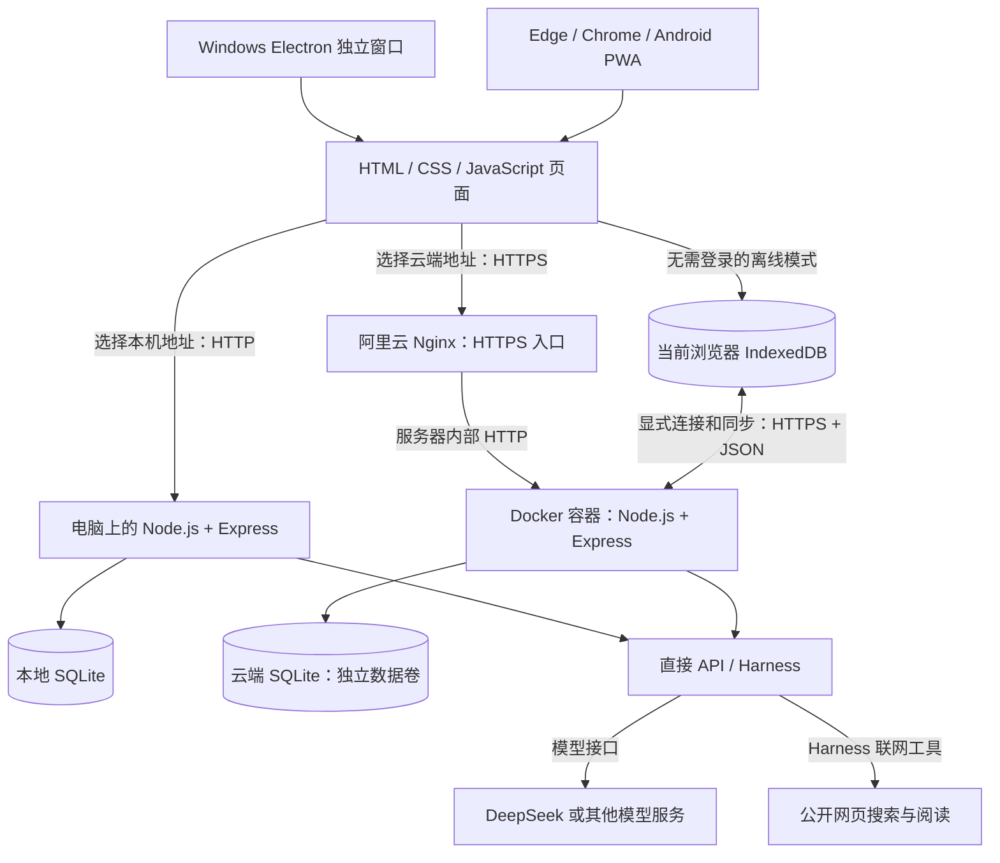
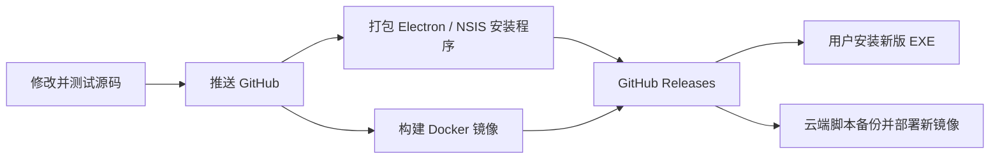

# Dayweave（时序）架构与工具链：从使用者视角理解

说明日期：2026-10-09。应用版本：0.1.5。按当前源码与已确认的部署方式编写。

时序的核心是一个网页应用：网页负责显示和交互，Node.js 后台负责账号、保存数据、调用 AI 和校验操作。相同的应用可以放在你的电脑上，也可以放在阿里云上。Windows 的 EXE 通过 Electron 提供独立窗口，并携带本地运行环境。

GitHub 保存代码和发布包，不保存个人业务数据库，也不负责运行日常日程服务。应用可以部署到自己的服务器；Harness 是否启用，以该实例执行部署脚本后的检查为准。

## 1. 先认识六个词

| 名词 | 在时序里具体指什么 |
| --- | --- |
| 前端 | 你看到的页面、日历、按钮、动画、对话框；主要在浏览器或 Electron 内运行。 |
| 后端 | 处理登录、保存、AI 请求、文件导入、通知的程序；入口是 `server.mjs`。 |
| 服务器 | 运行后端的电脑。可以是你自己的 Windows 电脑，也可以是租来的阿里云电脑。 |
| 数据库 | 有规则地保存和查询数据的系统。当前后端默认 SQLite；离线页面用 IndexedDB。 |
| API | 前端向后端或后端向 AI 服务提出请求的接口，例如“保存任务”“查询模型”。 |
| 协议 | 双方约定的通信方式。HTTP/HTTPS 负责发送请求，JSON 负责表达请求和结果。 |

“前端/后端”是职责划分，“本地/云端”是运行位置。这两组概念不能混为一谈：本地也能有后端。

## 2. 整体结构



图里的本机和云端是两个运行实例，不是本机必须先连接云端才能工作。浏览器也能打开本机服务。EXE 可以显示获准的网页，但当前默认优先打开正在运行的原版 `localhost:3088`；原版未运行时，准备并打开桌面独立空间 `localhost:3090`。

## 3. 三种数据使用方式：最重要的区别

| 使用方式 | 如何进入 | 主要数据在哪里 | 断网后的情况 |
| --- | --- | --- | --- |
| 本机后端 | 在自己电脑打开 `http://localhost:3088`，或桌面独立空间 `http://localhost:3090` | 电脑磁盘上的 SQLite 数据库 | 本机后台运行时，日程等管理功能仍可用；远程 AI 需要联网。 |
| 云端后端 | 打开 `https://your-server.example` 并登录 | 阿里云数据卷中的 SQLite 数据库 | 页面缓存不等于能继续读写云端数据库；离线工作需使用离线空间。 |
| 浏览器离线空间 | 点击“无需登录，使用本地空间” | 当前浏览器的 IndexedDB | 准备好离线资源后可以离线编辑任务、课程、灵感和复盘；这一模式目前不提供 AI、文件识别或推送服务。 |

界面中的“服务器模式”表示通过后台保存数据，并不一定表示在用阿里云。访问本机地址时，后台就在本机。

### 本地的几份数据也相互独立

- 开发目录的原版数据：项目下的 `data/planner.sqlite`。
- 安装版的桌面独立空间：默认 `%LOCALAPPDATA%\Shixu\data\planner.sqlite`；可定制源码在同级 `workspace` 文件夹。
- 浏览器离线数据：浏览器自己管理的 IndexedDB，并非上面两个 SQLite 文件。
- 云端数据：Docker 的 `dayweave-data` 命名数据卷，挂载为容器内部的 `/app/data`。

`localhost` 和 `127.0.0.1` 表示当前设备自己。手机输入 `localhost:3088` 指的是手机，不会指向你的电脑或阿里云。

不同浏览器、不同浏览器配置、不同网址通常有不同的离线存储。桌面 Electron 也有自己的浏览器配置。因此 Edge 中的离线数据不会自动出现在 EXE 中。清除网站数据可能清除 IndexedDB；需要迁移时使用导出、导入或同步。

主题、字体和气泡外观目前主要保存在浏览器 `localStorage` 中，是当前页面环境的偏好；不要假设它们都随云端账户同步。昵称、学校等个人资料保存在业务偏好中，可以随业务备份和同步迁移。

## 4. 一次保存操作实际经过什么

例如你新建“周五提交自控作业”。

在本机或云端后台模式中：

1. 前端收集标题、截止时间、预计耗时等内容。
2. 前端通过 HTTP/HTTPS 发出 API 请求，把内容表达成 JSON。
3. Express 后台确认登录身份，检查字段和数据版本，避免覆盖另一台设备刚保存的修改。
4. 后台把数据写入该账户的数据库空间。
5. 后台返回保存结果，前端重新显示列表。

在浏览器离线模式中，第 2～4 步改为在当前浏览器内校验并写入 IndexedDB，不需要发送到阿里云。之后只有你连接服务器并执行同步，或者启用已授权的自动同步，云端才会获得这些修改。

## 5. 阿里云内部怎么运行

当前采用 Linux + Nginx + Docker + SQLite：

```text
手机或电脑
    │ HTTPS，443 端口
    ▼
你的服务器上的 Nginx
    │ HTTP，127.0.0.1:3088
    ▼
Docker 的 dayweave 容器
    ├── Node.js + Express：运行时序后端
    ├── public/：提供网页文件
    ├── /opt/harness：Harness 镜像中的引擎文件
    └── /app/data → dayweave-data：独立保存个人数据
```

“端口”用于区分一台电脑上的不同服务：443 是 HTTPS 的常用入口；3088 是时序程序的入口；80 还承担当前证书验证等 HTTP 访问。3088 只映射到服务器自身的回环地址，不是给手机直接访问的公网入口。

Nginx 接收公网请求、处理 HTTPS，再把请求转交给时序。这叫反向代理。它不负责保存你的课程和任务。Let’s Encrypt 提供 HTTPS 证书，Certbot 与已配置的定时任务负责续期。

### 镜像、容器、数据卷

| 名词 | 当前项目里的含义 |
| --- | --- |
| 镜像 | 已装好程序及运行环境的模板，例如 `dayweave:harness-0.1.5`。 |
| 容器 | Docker 根据镜像启动的运行实例；目前服务容器叫 `dayweave`。 |
| 数据卷 | 与程序模板分开的持久存储区；目前叫 `dayweave-data`。 |

升级通常是下载新镜像，备份数据，停止旧容器，再用新镜像启动容器并连接原数据卷。程序更新了，账号和任务仍来自原数据卷。公开镜像没有个人数据库或 API 密钥，也没有 DeepSeek 模型权重。

云端使用 SQLite，不需要另装 MySQL。代码支持 MySQL 作为可选后端，用于其他部署环境；“支持 MySQL”不代表当前阿里云正在使用它。

## 6. 数据库里是什么

SQLite 是嵌入式数据库：Node.js 直接使用磁盘上的数据库文件，不需要额外启动一个数据库服务。项目使用 `node:sqlite`，SQLite 模式要求 Node.js 24+。

目前主要表如下：

| 表 | 保存什么 |
| --- | --- |
| `kv` | 账户、个人业务状态、AI 配置、对话和恢复点等。业务状态主要是 JSON 文档。 |
| `sessions` | 浏览器登录会话及到期时间。 |
| `sync_tokens` | 某个客户端连接服务器的同步授权。 |
| `sync_receipts` | 已完成同步的回执，避免网络重试重复写入。 |
| `notices` | 已发送提醒的记录。 |

当前不是给每份作业单独建立复杂的 SQL 表；课程、任务、灵感、日程、复盘等主要放在账户状态文档里。数据版本号 `revision` 用来检测修改冲突。

多个账户共用一个数据库，但由应用按账户标识划分保存空间，并在每次请求中检查身份。不是每个用户运行一套容器或一台服务器。管理员仍能在服务器层面访问数据库，这不属于端到端加密。

密码保存为 scrypt 计算的验证结果，不保存明文密码。AI 密钥用 AES-256-GCM 加密，解密密钥保存于独立的 `secret.key` 文件。完整迁移或恢复时，数据库和这个密钥都要保留。

## 7. 传输协议：谁和谁在说话

| 连接 | 方式 | 用途 |
| --- | --- | --- |
| 页面 ↔ 本机后台 | HTTP + JSON | 本机登录、查询、保存。通信留在本机。 |
| 页面 ↔ 云端入口 | HTTPS + JSON | 加密传输云端登录及业务请求。 |
| Nginx ↔ 容器 | 回环地址上的 HTTP | 把公网请求转发给应用。 |
| 离线空间 ↔ 同步服务器 | HTTPS + JSON + Bearer 授权令牌 | 查询、预览与提交同步。 |
| 后台 ↔ AI 服务 | HTTP 接口；远程通常为 HTTPS | 使用配置的模型地址与 API 密钥请求模型。 |
| Harness 子进程 ↔ Harness SDK | JSON-RPC，底层使用进程输入/输出通道 | 启动、调用与接收引擎结果。 |
| Harness ↔ 时序工具桥 | 本机回环 HTTP + 临时令牌 | 查询任务、提交待保存操作、搜索和阅读网页。 |

JSON 是一种数据表达格式，例如 `{ "title": "自控作业", "minutes": 60 }`；它不是数据库，也不是网络连接本身。

HTTPS 是 HTTP 加上 TLS 加密。你的公网 IP 是服务器地址；域名可以给地址起一个方便记忆的名字，当前访问方式不依赖自定义域名。

登录后，页面通过 HttpOnly Cookie 携带会话。同步使用单独的令牌，不依赖页面登录 Cookie。它们是两种用途不同的授权。

Harness 对话从后端到页面使用逐行 JSON 的流式响应，称为 NDJSON，因此页面能逐步显示文字和执行状态。模型接口侧也可能使用 SSE 事件流。当前不需要 WebSocket 来实现这段聊天流程。

## 8. 手机和电脑如何同步

**两台设备都直接登录同一云端账户**：访问的是同一份云端数据，没有两份数据库需要手动合并。但当前页面不是实时协作系统，另一台设备已经打开的列表可能需要刷新才能看到更新。

**设备使用浏览器离线空间**：本地和云端是两份数据，需要同步协议处理。

```text
连接服务器并授权
→ 获取云端数据
→ 比较本地、云端和上次同步基准
→ 预览新增、修改、删除和冲突
→ 用户确认或已授权的自动同步
→ 云端提交成功
→ 更新本地数据与同步基准
```

同一条任务两边都修改时，需要选择保留哪一版。没有共同历史的第一次同步不会直接把单边独有记录当作删除。请求带有操作标识，服务器识别重试，避免重复执行。

自动同步需要先手动完成一次同步并主动开启，当前在应用打开且联网时工作；不能理解成手机应用关闭后一定持续同步。

同步范围主要是课程、任务、灵感、日程、复盘和业务偏好。它不同步密码、AI 密钥、聊天历史或所有设备外观设置。本机 SQLite 后台与云端 SQLite 也没有直接的数据库复制；当前同步界面围绕浏览器离线空间工作。

## 9. AI 与 Harness 在哪里

普通 AI 请求：页面 → 当前后台 → 配置的模型 API → 后台处理结果 → 页面。

Harness 请求：页面 → 当前后台 → Harness → 模型 API；模型需要查询或修改日程时，Harness 调用时序提供的工具。后台校验修改，整轮成功后才统一保存，并保留可撤销信息。

“当前后台”取决于你打开的地址：打开本机服务，AI 请求由本机后台发起；打开云端网址，由阿里云后台发起。密钥也应配置在实际使用的那个账户和后台中。

Harness 的已适配版本是 `0.1.0-rc.5`，与时序版本 `0.1.5` 是两个独立的软件版本。Harness 当前支持 OpenAI Chat Completions 兼容格式；普通直接 API 还支持 Anthropic Messages 格式。

Harness 能调用课程查询、业务修改、模型配置信息、公开网页搜索和阅读工具。搜索实现使用 Bing 公开页面，能否返回结果还取决于服务器网络和目标页面。它不是安装在服务器上的 DeepSeek 大模型；模型仍通过你配置的 API 提供。

### AI 修改软件代码是另一条流程

定制工作台：用户描述需求 → 隔离的源码副本 → AI 修改候选代码 → Docker 内运行测试 → 独立审查会话 → 检查源码冲突 → 整合并保留恢复点。

这些测试使用隔离环境，不把真实账号数据和 API 配置复制给候选程序。聊天 Harness 可用，不代表源码开发工作台已开放。当前云端部署保持 `SHIXU_DEVELOPMENT=disabled`；本地定制按需配置 Docker、Harness 等环境。AI 修改源码也不等于自动制作 EXE 或自动部署服务器。

## 10. 语言和工具链

| 工具 / 技术 | 在工程中承担什么 |
| --- | --- |
| JavaScript | 时序前端、后端、桌面控制脚本和多数业务逻辑的主要语言；`.mjs` 是 JavaScript 模块。 |
| HTML / CSS | 页面结构、布局、主题、字体、动画和模拟材质。前端未采用 React 或 Vue。 |
| Node.js | 让 JavaScript 能在电脑或服务器中读写文件、访问数据库、调用网络接口。 |
| Express 5 | 后端路由、HTTP API、请求处理和网页文件服务。 |
| SQLite / `node:sqlite` | 默认后端数据库。 |
| MySQL / `mysql2` | 可选数据库后端；不是当前云端必需组件。 |
| IndexedDB / localStorage | 浏览器离线业务数据与设备界面偏好。 |
| Service Worker / PWA | 缓存网页资源，支持离线页面和 Android 添加到主屏幕。当前没有发布 Android APK。 |
| Electron 44.5.1 | Chromium 页面内核加桌面能力，提供独立窗口、托盘、菜单等。 |
| electron-builder 26.15.3 / NSIS | 生成 Windows 安装 EXE。 |
| C# / .NET 编译器 | 较早的便携启动器 `desktop/Shixu.cs`；不是核心业务后端语言。 |
| PowerShell / Bash | Windows 启动与打包、Linux 下载及部署脚本。 |
| Git / GitHub | 版本记录、源码托管和 Releases 下载发布。 |
| Docker / Dockerfile | 固定运行环境、制作服务器镜像、运行 AI 定制测试环境。 |
| WSL / Docker Desktop | Windows 上按需运行 Linux 容器，主要用于构建和定制开发。普通日程使用不必安装 Docker。 |
| Nginx / Certbot / Let’s Encrypt | 当前阿里云 HTTPS 入口、证书申请与续期。 |
| systemd | 云端系统服务与证书续期定时任务。 |
| npm / package-lock.json | 安装时序依赖，固定构建时使用的依赖版本。 |
| pnpm 11.7.0 | 构建被固定到具体提交的 DeepSeek Harness。Harness 自身主要是 TypeScript 工程。 |
| Node 内置测试 / Playwright | 业务、后端、同步与实际页面操作测试。 |
| ExcelJS / pdf-parse / Multer | Excel 解析、文字 PDF 提取、文件上传。 |
| web-push / Nodemailer | 可选浏览器推送和邮件提醒，需要相应部署配置及设备权限。 |
| Codex / DeepSeek API | 开发协助或用户配置的 AI 服务；不是数据库或服务器运行环境。 |

目前整体是一个 Node.js 应用，按模块拆分职责；没有拆成多套微服务。桌面和云端复用核心代码，减少分别维护两套业务逻辑的工作。

## 11. 发布与更新的关系



源码版本、已安装 EXE 版本和服务器实际运行版本可能不同。推送代码不会自动更新另两个地方，当前发布流程仍需构建、发布、安装或部署。

“检查更新”查询 GitHub 正式 Release；没有 Release 时说明源码版本。当前按钮提供信息和下载入口，不自动安装。EXE 分别显示页面版本和窗口版本，用来识别界面来自哪个后台，以及桌面程序本身是否升级。

当前 2 GB 云服务器使用预构建 Harness 镜像，避免在服务器上编译大型依赖。先在较大内存的构建环境制作镜像，再下载到服务器运行。

## 12. 源码入口与运维入口

| 文件 / 目录 | 查看它能理解什么 |
| --- | --- |
| `public/app.js` | 页面操作、页面渲染和 API 请求。 |
| `public/local-store.mjs` | IndexedDB 离线保存与同步状态。 |
| `public/sync-client.mjs`、`public/sync-merge.mjs` | 连接服务器、预览合并和冲突处理。 |
| `server.mjs` | 后端启动、账号认证、业务接口、AI 和提醒。 |
| `accounts.mjs` | 邀请注册、会话、多账户数据隔离。 |
| `storage.mjs` | SQLite / MySQL 访问和事务。 |
| `harness/` | 引擎启动、时序工具、网页搜索和阅读。 |
| `development/` | 隔离源码开发、容器测试、审查、整合和恢复。 |
| `desktop/` | Electron 窗口、本地空间准备和 Windows 打包。 |
| `deploy/` | Harness 镜像构建、下载、校验、备份及云端切换。 |
| `tests/` | 自动化验证。 |

常用命令的含义：`npm ci` 安装依赖；`npm start` 运行后台；`npm test` 验证程序；`npm run test:ui` 验证页面；`npm run build:installer` 制作 Windows 安装包。服务器上的 `bash deploy/install-harness-image.sh` 是下载校验镜像并调用升级脚本，不是运行 AI 对话。

业务 JSON 导出用于迁移课程等数据，不包含登录密码、AI 密钥或聊天。完整服务备份应保留 SQLite 数据库、`secret.key`，并按需保存 Harness 原始会话目录及运行配置。备份、数据同步和软件更新解决的是不同问题。

进一步操作参见：[账户和云端部署](ACCOUNTS_AND_CLOUD.md)、[桌面说明](WINDOWS_DESKTOP.md)、[本地模式](LOCAL_MODE.md)、[手动同步](MANUAL_SYNC.md)、[Harness 集成](HARNESS_INTEGRATION.md)。
